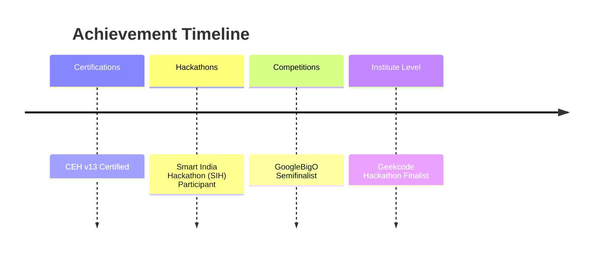

<align="center">
  
</h1>

<p align="center">
  
</p>

<p align="center">
  
  
  
</p>

---

## 🧑‍💻 About Me

```yaml
name: "Shivanshu Jha"
role: "4th Year CS Student | Aspiring Software Developer"
focus: ["DSA & Problem Solving", "Full Stack Development", "AI/ML", "Open Source"]
currently_exploring: "Open Source Contributions 🌱"
fun_fact: "I debug better than I sleep 😴"
```

- 🔭 Currently building cool projects and diving deeper into **open-source**
- 💡 Passionate about **Data Structures, Algorithms & Competitive Programming**
- 🤖 Exploring **AI/ML** fundamentals and building real-world ML apps
- ⚡ Always up for **hackathons** and collaborative challenges
- 📫 Reach me at: **jhashivanshu5521@gmail.com**

---

## 🏆 Competitive Programming Journey

<p align="center">
  
  
  
</p>

<p align="center">
  
</p>

<div align="center">

| Platform | Rating / Stats |
|:---:|:---:|
| 🟧 **LeetCode** | `1613` Rating · 800+ Combined Problems Solved |
| 🟫 **CodeChef** | `1383` Rating |
| 🟦 **Codeforces** | `600+` Newbie |
| 🟩 **GeeksforGeeks / HackerRank** | Active Problem Solver |

</div>

> 💭 *"Consistency in solving problems today is the confidence to solve bigger problems tomorrow."*

---

## 🛠️ Tech Stack & Tools

<p align="center">
  
</p>

<details>
<summary><b>📂 Click to expand full stack breakdown</b></summary>
<br>

**Languages**
<p>


</p>

**Frameworks & Libraries**
<p>


</p>

**Tools & Platforms**
<p>


</p>

**Core Knowledge**
<p>


</p>

</details>

---

## 🎖️ Achievements & Milestones

<div align="center">



</div>

<table align="center">
  <tr>
    <td align="center">🛡️<br><b>CEH v13</b><br>Certified Ethical Hacker</td>
    <td align="center">🇮🇳<br><b>SIH</b><br>Active Participant</td>
    <td align="center">🚀<br><b>GoogleBigO</b><br>Semifinalist</td>
    <td align="center">🏫<br><b>Geekcode Hackathon</b><br>Institute Finalist</td>
  </tr>
</table>

---

## 📊 GitHub Analytics

<p align="center">
  
  
</p>

<p align="center">
  
</p>

<p align="center">
  
</p>

---

## 🐍 Contribution Graph

<p align="center">
  
</p>

<sub><i>⚙️ Snake animation requires a one-time GitHub Action setup — see the "How to Activate Animations" note below.</i></sub>

---

## 🌐 Let's Connect

<p align="center">
  <a href="https://www.linkedin.com/in/shivanshu-jha-86608b28b/"></a>
  <a href="https://leetcode.com/shivanshujha"></a>
  <a href="https://codechef.com/users/your-codechef"></a>
  <a href="https://codeforces.com/profile/shivanshujha"></a>
  <a href="mailto:jhashivanshu5521@gmail.com"></a>
</p>

<p align="center">
  
</p>

<p align="center"><i>⭐ Thanks for stopping by — let's build something great together!</i></p>
